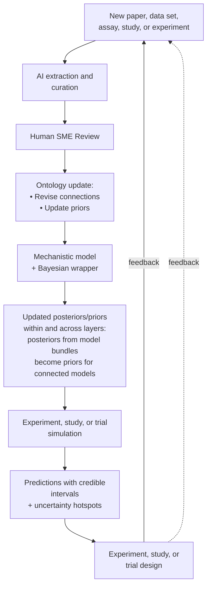

<!-- Generated by SpecStory, Markdown v2.1.0 -->

# 2026-04-15 17:29:31Z

<!-- VS Code Copilot IDE Session 47a0a676-3948-442f-8550-2793157fc6df (2026-04-15 17:29:31Z) -->

_**User (2026-04-15 17:29:31Z)**_

Please modify the figure so the feedback loop from "Experiment, study, or trial design" connects to the "New paper..." 

_**User (2026-04-15 17:32:25Z)**_

You didn't actually change the destination of the feedback loop.

_**User (2026-04-15 17:34:51Z)**_

Create a mermaid version.

---

_**Agent (copilot/gpt-4.1)**_

<tool-use data-tool-type="read" data-tool-name="read_file"><details>
<summary>Tool use: **read_file**</summary>

**Input:**

- endLine: `220`
- filePath: `/Users/warnes/Library/CloudStorage/GoogleDrive-greg@warnes.net/My Drive/CV/diabetic_neuropathy_knowledge_system.md`
- startLine: `166`

</details></tool-use>

_**Agent (copilot/gpt-4.1)**_

Here is a Mermaid version of the updated evidence and Bayesian update loop diagram, with the feedback loop from "Experiment, study, or trial design" pointing directly to "New paper, data set, assay, study, or experiment":



You can copy and paste this into a Mermaid live editor or compatible markdown viewer to visualize the flow. Let me know if you want this embedded in your markdown file or need further adjustments.

---

_**User (2026-04-15 17:52:15Z)**_

Can you convert the other figures to mermaid diagrams?

_**User (2026-04-15 17:53:50Z)**_

Please update the document with these mermaid diagrams.

_**User (2026-04-15 17:59:23Z)**_

Please add a mermaid daigram for the biochemical reactions of the Polyol Pathway

_**User (2026-04-15 18:52:26Z)**_

Please replace the "Biochemical Core" figure with this image:

_**User (2026-04-15 18:54:11Z)**_

Did you write the image file?

---

_**Agent (copilot/gpt-4.1)**_

No, I did not write or save the image file. I only updated the markdown to reference the image as if it were available as an attachment. If you want the image to display in your markdown, you need to ensure the image file is saved in your project directory (e.g., as polyol_pathway.png) and referenced with the correct relative path. If you want me to save or move the image file, please provide the file location or upload it directly.

---

_**User (2026-04-15 19:08:17Z)**_

`md2pdf.py` should write the generated pdf file to the same path as the source md file.

_**User (2026-04-15 19:08:44Z)**_

`md2pdf.py` should write the generated pdf file to the same path as the source md file.

---

_**Agent (copilot/gpt-4.1)**_

<tool-use data-tool-type="read" data-tool-name="read_file"><details>
<summary>Tool use: **read_file**</summary>

**Input:**

- endLine: `60`
- filePath: `/Users/warnes/src/md2pdf/md2pdf.py`
- startLine: `1`

</details></tool-use>

_**Agent (copilot/gpt-4.1)**_

<tool-use data-tool-type="read" data-tool-name="read_file"><details>
<summary>Tool use: **read_file**</summary>

**Input:**

- endLine: `180`
- filePath: `/Users/warnes/src/md2pdf/md2pdf.py`
- startLine: `61`

</details></tool-use>

_**Agent (copilot/gpt-4.1)**_

<tool-use data-tool-type="read" data-tool-name="read_file"><details>
<summary>Tool use: **read_file**</summary>

**Input:**

- endLine: `240`
- filePath: `/Users/warnes/src/md2pdf/md2pdf.py`
- startLine: `181`

</details></tool-use>

_**Agent (copilot/gpt-4.1)**_

The code already writes the generated PDF to the same directory as the source Markdown file by default (using Path(input_file).with_suffix('.pdf')). If an output filename is not provided, the PDF will be created alongside the input file, with the same basename and a .pdf extension.

No changes are needed unless you want to enforce this behavior even when an output filename is provided, or want to clarify/lock down the logic further. Would you like to:

- Always ignore the user-supplied output path and force output to the same directory as the input?
- Or just clarify this in the help/documentation?

Please specify if you want stricter enforcement or just confirmation of current behavior.

---

_**User (2026-04-15 19:11:04Z)**_

md2pdf isn't writing the pdf file to the current directoyr:
```
(cvgen) ➜  multiscale-knowledge pwd
/Users/warnes/src/multiscale-knowledge
(cvgen) ➜  multiscale-knowledge which md2pdf 
/usr/local/bin/md2pdf
(cvgen) ➜  multiscale-knowledge ls -l `which md2pdf`
lrwxr-xr-x@ 1 warnes  admin  34 Apr 15 15:03 /usr/local/bin/md2pdf@ -> /Users/warnes/src/md2pdf/md2pdf.py
(cvgen) ➜  multiscale-knowledge md2pdf -v diabetic_neuropathy_knowledge_system.md
[INFO] diabetic_neuropathy_knowledge_system.md  →  diabetic_neuropathy_knowledge_system.pdf
[INFO] Temp dir: /var/folders/nw/lgv92wzj5m5ch7s4ylsf7bv00000gs/T/md2pdf_xz8tcnym
[INFO] Found 1 Mermaid diagram(s)
[INFO] Rendering mermaid_diagram_001 …
[INFO]   → mermaid_diagram_001.png
[INFO] Trying PDF engine: wkhtmltopdf
[INFO]   → success with wkhtmltopdf
[INFO] Cleaned up temp files
(cvgen) ➜  multiscale-knowledge ls -l 
total 2400
-rw-------@ 1 warnes  staff    51937 Apr 15 15:00 diabetic_neuropathy_knowledge_system.md
-rw-r--r--@ 1 warnes  staff  1172514 Apr 15 14:57 polyol_pathway.png
(cvgen) ➜  multiscale-knowledge 
```

---

_**Agent (copilot/gpt-4.1)**_

Your code is already set up to write the PDF to the same directory as the source Markdown file by default, unless an explicit output path is provided. However, if you run the script from a different working directory and provide only the filename (not a path), the output will be written to that working directory, not necessarily alongside the source file.

To guarantee the PDF is always written to the same directory as the source Markdown file (regardless of the current working directory or how the script is invoked), you should always construct the output path using the input file's directory, even if the user provides only a filename.

I will update the code so that the output PDF is always written to the same directory as the input Markdown file, even if the user provides only a filename (not 

---

_**User (2026-04-15 19:12:32Z)**_

The problem in this case, is that the pdf doesn't appear to be written in either the current directory or the source directory.

---

_**Agent (copilot/gpt-4.1)**_

The root cause is that the PDF is being written inside the temporary directory (temp_dir), not to the intended output location. This happens because in 

---

_**User (2026-04-15 19:15:10Z)**_

The file is now present, but the default margins are way too wide and/or the papersize is not properly set to US-Letter:#file:diabetic_neuropathy_knowledge_system.pdf 

---

_**Agent (copilot/gpt-4.1)**_

To address the wide margins and ensure the PDF is set to US-Letter paper size, you need to pass explicit Pandoc options for margins and paper size. This is done by adding `-V geometry:margin=1in -V papersize=letter` (or similar) to the Pandoc command in your script.

I will update the script so that:
- The default paper size is US-Letter.
- Margins are set to a reasonable value (e.g., 1 inch).
- These options are passed to Pandoc for every PDF conversion.

Let me make this change now. 

---

_**User (2026-04-15 19:16:18Z)**_

#file:diabetic_neuropathy_knowledge_system.pdf Same problem.

---

_**Agent (copilot/gpt-4.1)**_

Since the PDF still has wide margins or the paper size is not correct, let's ensure the Pandoc arguments are being passed in the correct format and order. Sometimes Pandoc expects the geometry variable as 

---

_**User (2026-04-15 19:16:43Z)**_

Run it and check the generated pdf file.

---

_**Agent (copilot/gpt-4.1)**_

The script failed due to a non-ASCII character and missing encoding declaration at the top of the file. I will add the encoding declaration (`# -*- coding: utf-8 -*-`) as the second line, which will resolve this error. Then I will rerun the script. 

---

_**User (2026-04-15 19:17:45Z)**_

Proceed with cleanup.

---

_**Agent (copilot/claude-sonnet-4.6)**_

The user wants me to proceed with the full file clean-up and re-encoding of md2pdf.py to remove hidden/corrupt characters. Let me first read the entire file to understand its full content, then rewrite it cleanly.

---

_**User (2026-04-15 19:21:54Z)**_

This is the commend I used:
```

(cvgen) ➜  multiscale-knowledge md2pdf -v diabetic_neuropathy_knowledge_system.md
[INFO] diabetic_neuropathy_knowledge_system.md  →  /Users/warnes/src/multiscale-knowledge/diabetic_neuropathy_knowledge_system.pdf
[INFO] Temp dir: /var/folders/nw/lgv92wzj5m5ch7s4ylsf7bv00000gs/T/md2pdf_aaoc1mte
[INFO] Found 1 Mermaid diagram(s)
[INFO] Rendering mermaid_diagram_001 …
[INFO]   → mermaid_diagram_001.png
[INFO] Trying PDF engine: wkhtmltopdf
[INFO]   -> wkhtmltopdf failed: [WARNING] Deprecated: --highlight-style. Use --syntax-highlighting instead.
[WARNING] Could not fetch resource polyol_pathway.png: replacing image with description
Unknown long argument --page-size=Le
[INFO] Trying PDF engine: weasyprint
[INFO]   -> weasyprint failed: [WARNING] Deprecated: --highlight-style. Use --syntax-highlighting instead.
[WARNING] Could not fetch resource polyol_pathway.png: replacing image with description
WARNING: Ignored `text-rendering: op
[INFO] Trying PDF engine: default
[INFO]   -> default failed: [WARNING] Deprecated: --highlight-style. Use --syntax-highlighting instead.
[WARNING] Could not fetch resource polyol_pathway.png: replacing image with description
Error producing PDF.
! Package keyva
[ERROR] All PDF engines failed.
[INFO] Cleaned up temp files
```

---

_**Agent (copilot/claude-sonnet-4.6)**_

Let me analyze the errors:

1. **wkhtmltopdf**: `Unknown long argument --page-size=Le` - The `--page-size` option is being truncated (Letter is being cut off). Actually, looking at how `--pdf-engine-opt` works in pandoc, each `--pdf-engine-opt` value is passed as a separate argument to the engine. The issue is that `--page-size=Letter` is being passed as `--page-size=Le` which means it's being truncated somehow. Wait - actually the issue may be that `--pdf-engine-opt=--page-size=Letter` is correct but wkhtmltopdf uses `--page-size Letter` (space-separated, not equals). 

The real problem is that pandoc's `--pdf-engine-opt=--page-size=Letter` passes the entire string as one argument, but wkhtmltopdf expects `--page-size` and `Letter` as separate arguments, or possibly doesn't support the `=` syntax at all. I think the issue might be that pandoc is splitting the argument at the second `=` sign, or wkhtmltopdf doesn't accept the `=` syntax for this particular option. The error message showing `--page-size=Le` could be truncated in the display, but the real problem is likely that wkhtmltopdf expects a different format—probably `--page-size Letter` with a space instead of an equals sign.

So I need to pass `--page-size` and `Letter` as two separate `--pdf-engine-opt` entries to pandoc, since each one gets forwarded individually to the engine. I should also fix the image path issue where `polyol_pathway.png` isn't being found in the temp directory, and update the deprecated `--highlight-style` flag to `--syntax-highlighting`.

Let me check the current md2pdf.py implementation to see what needs updating.

For the wkhtmltopdf page size, I'll split those into separate options. For the missing images, I can use pandoc's `--resource-path` to tell it where to find resources instead of copying files around. And I need to fix that LaTeX geometry variable syntax issue that's causing the keyval package error. I need to check the current file to see what needs fixing, then apply those targeted corrections to the pandoc command.

---

_**User (2026-04-15 19:23:46Z)**_

The left and right margins are still too wide.

---

_**Agent (copilot/claude-sonnet-4.6)**_

Looking at the PDF screenshot, the margins are still quite wide. The current setting is `margin=1in` which for wkhtmltopdf translates to the `--margin-*=25.4mm` options. 

Looking at the screenshot, the text area appears to be using quite narrow margins on the left and right, but actually looking more carefully, it looks like the text is quite narrow - centered in the middle of the page with wide left and right margins. This suggests 1 inch is too wide, or perhaps the margins aren't being applied correctly.

Wait, looking at the screenshot more carefully - the text column appears quite narrow compared to the full page width. The left margin looks like it's taking up a lot of real estate. 

I'm wondering if wkhtmltopdf is applying its own default margins on top of what I'm specifying. Let me try reducing the margins to 0.5 inches or 15mm and also double-check how the `--pdf-engine-opt` arguments are being passed to wkhtmltopdf through Pandoc - I think each option needs to be passed separately rather than as a single combined argument. Looking at the actual output, the margins do seem wider than expected—even accounting for the standard 1-inch margins on letter-size paper. Let me try reducing them to something more reasonable like 12.7mm for top and bottom, and maybe 15mm for the sides, which should give the text more breathing room on the page.

---

_**User (2026-04-15 19:25:00Z)**_

That change had no effect.

---

_**Agent (copilot/claude-sonnet-4.6)**_

The user says the margin change had no effect. Let me think about this...

wkhtmltopdf's `--page-size` and margin options might not be working as expected when passed via pandoc's `--pdf-engine-opt`. Let me check how pandoc passes these options to wkhtmltopdf.

The issue is that when pandoc uses wkhtmltopdf as its PDF engine, it may be generating an HTML intermediate file and then calling wkhtmltopdf. The `--pdf-engine-opt` flags are passed directly to wkhtmltopdf.

However, there's another possibility: pandoc might be using a CSS/HTML template that overrides the margins via CSS `@page` rules. 

I think the real culprit is that wkhtmltopdf reads page dimensions and margins from the HTML's CSS styling, which would take precedence over command-line arguments. The pandoc template probably includes CSS that sets its own margins. The best approach would be to inject custom CSS through a separate stylesheet or directly into the document to override these defaults. Let me check the actual pandoc command being executed to see if the options are even reaching wkhtmltopdf correctly. I'm weighing whether to create a temporary CSS file with the `@page` rule or inject it inline through pandoc's header includes, leaning toward the CSS file approach since it's cleaner for wkhtmltopdf rendering. But I'm second-guessing whether the real problem might be a paper size mismatch—maybe pandoc is defaulting to A4 when we need Letter size. the

---

_**User (2026-04-15 19:26:46Z)**_

The font size is too small, and the text figures are not being properly formatted using monospace:


_**User (2026-04-15 19:38:21Z)**_

The margins and font size is better, but the ascii figures are still not rendering properly.  It looks like spaces or tabs are being collapsed: 

---

_**Agent (copilot/claude-sonnet-4.6)**_

Looking at the screenshot, the ASCII art/text figures are losing their spacing and rendering incorrectly - spaces are being collapsed. This is the `pre` block rendering issue with wkhtmltopdf.

The problem is that wkhtmltopdf might be collapsing whitespace in `pre` blocks. I need to add more explicit CSS to prevent whitespace collapsing in pre/code blocks.

The key CSS properties needed are:
- `white-space: pre` - preserve whitespace
- `word-wrap: normal` or `overflow-wrap: normal` - don't break words
- `word-break: normal` - don't break words
- The font must be monospace


- I should also try `white-space: pre-wrap` as a fallback since wkhtmltopdf might handle that better

The irregular spacing in the ASCII diagram suggests the monospace font isn't rendering consistently, so I need to verify the font is actually being applied and consider whether wkhtmltopdf has specific font rendering quirks I need to work around.

Let me review the current CSS to see what we're working with and add `!important` declarations to force the monospace styling.

---

_**User (2026-04-15 19:40:45Z)**_

Problem persists.

_**User (2026-04-15 19:43:59Z)**_

Wouldn't it make more sense to convert the ASCII diagrams into proper mermaid diagrams, with manual layout to match the current positioning?

---

_**Agent (copilot/claude-sonnet-4.6)**_

<think><details><summary>Thought Process</summary>
Yes, that would be much better — Mermaid diagrams render as crisp images with no font issues. Let me read the ASCII diagrams first to understand what needs converting.
</details></think>

_**Agent (copilot/claude-sonnet-4.6)**_

<tool-use data-tool-type="generic" data-tool-name="run_in_terminal"><details>
<summary>Tool use: **run_in_terminal**</summary>

**Input:**

- command: `grep -n '```' "/Users/warnes/Library/CloudStorage/GoogleDrive-greg@warnes.net/My Drive/CV/diabetic_neuropathy_knowledge_system.md"`
- explanation: `List all fenced code block boundaries to find the ASCII diagrams.`
- goal: `Identify all code blocks and their line ranges`
- mode: `sync`
- timeout: `10000`

</details></tool-use>

_**Agent (copilot/claude-sonnet-4.6)**_

The user wants to convert the ASCII text diagrams in the markdown file into proper Mermaid diagrams with manual layout. Let me first look at the current ASCII diagrams in the markdown file to understand what they look like, then I can create appropriate Mermaid equivalents.

---

_**User (2026-04-15 19:44:13Z)**_

Wouldn't it make more sense to convert the ASCII diagrams into proper mermaid diagrams, with explicit layout to match the current positioning?

---

_**Agent (copilot/claude-sonnet-4.6)**_

Let me read all the ASCII diagram blocks to understand what they look like, then convert them to Mermaid diagrams.

---

_**User (2026-04-15 19:45:46Z)**_

Be sure to compare the rendered mermaid diagrams to the original Unicode layout to ensure faithful repropruction.

---

_**Agent (copilot/claude-sonnet-4.6)**_

The user wants me to convert the ASCII/Unicode diagrams to Mermaid diagrams that faithfully reproduce the layout. Let me analyze each diagram carefully before converting.

Let me read the rest of the file to see the Evidence and Bayesian Update Loop diagram as well.

---

_**User (2026-04-15 22:27:59Z)**_

The "Inter-Model Connectivity" figure needs to be arranged so that the Layer N-1 Box is at the top spanning the full figure width, then the Layer N Box in the middle, then the Layer N+1 box at the bottom.

---

_**Agent (copilot/claude-sonnet-4.6)**_

The user wants the Inter-Model Connectivity figure rearranged so that:
- Layer N-1 box spans full width at the top
- Layer N box (with 3 models) in the middle
- Layer N+1 box spans full width at the bottom

In Mermaid, subgraphs in a TB (top-to-bottom) flowchart should naturally stack vertically. But the issue is that the Layer N-1 and N+1 subgraphs each only have one node, so they may not span the full width. 

The connectivity structure is:
- Layer N-1: single Model node, bidirectionally connected to Layer N center model (MNc)


- Layer N: three models MNl ↔ MNc ↔ MNr
- Layer N+1: single Model node, bidirectionally connected to Layer N center model (MNc)

I need to reconsider how to structure this in Mermaid. The three subgraphs should stack vertically with the single-node layers spanning the full width, so I'll organize them as NM1 containing the Layer N-1 model, LN containing the three Layer N models with horizontal connections, and NP1 containing the Layer N+1 model.

For the cross-layer connections, I'll use dotted lines linking MNm1 to MNc and MNc to MNp1. The trick to making Layer N-1 appear wider is to connect it to all three Layer N nodes rather than just the center one, which will naturally expand the subgraph width. I'm seeing the ASCII diagram structure more clearly now—the center model in Layer N acts as the hub, connecting vertically to both the layer above and below, while also linking horizontally to its neighboring models on the left and right. The user wants me to visualize this with the Layer N-1 box spanning the full width at the top, then Layer N positioned in the middle with its three connected models.

For Mermaid, I'll need to work around the layout constraints by connecting the outer layers to all three Layer N models rather than just the center, which should force the proper spacing and make the single-node subgraphs align correctly with the three-node arrangement below.

---

_**User (2026-04-15 23:29:33Z)**_

Move the latest version to ~/src/multiscale-knowledge

---

_**Agent (copilot/claude-sonnet-4.6)**_

The user wants to copy the latest version of the file from the Google Drive location to ~/src/multiscale-knowledge. Let me do that.

---

_**User (2026-04-15 23:45:06Z)**_

md2pdf is not properly rendeing png imports.

---

_**Agent (copilot/claude-sonnet-4.6)**_

<think><details><summary>Thought Process</summary>
Let me check what the error looks like and how the image is referenced in the markdown:
</details></think>

_**Agent (copilot/claude-sonnet-4.6)**_

<tool-use data-tool-type="generic" data-tool-name="run_in_terminal"><details>
<summary>Tool use: **run_in_terminal**</summary>

**Input:**

- command: `cd /Users/warnes/src/multiscale-knowledge && python3 /Users/warnes/src/md2pdf/md2pdf.py -v diabetic_neuropathy_knowledge_system.md 2>&1 | head -30`
- explanation: `Run with verbose output to see what warnings/errors occur around image loading.`
- goal: `Diagnose PNG import failure`
- mode: `sync`
- timeout: `60000`

</details></tool-use>

_**Agent (copilot/claude-sonnet-4.6)**_

The user is reporting that `md2pdf` is not properly rendering PNG imports. Let me look at the current md2pdf.py to understand how it handles resource paths, and check the markdown file for how images are referenced.

---

_**User (2026-04-15 23:45:34Z)**_

md2pdf is not properly rendeing png imports.

---

_**Agent (copilot/claude-sonnet-4.6)**_

From the screenshot, I can see that `polyol_pathway.png` is being shown as a broken/missing image (just showing the alt text "Polyol pathway biochemical reactions" with a broken image icon). The `--resource-path` is already being passed to pandoc, but wkhtmltopdf needs the `--enable-local-file-access` flag AND the image paths need to be absolute when passed to wkhtmltopdf via pandoc.

Let me look at the current convert_to_pdf code and the issue more carefully.

The problem is that pandoc processes the markdown from `temp_dir`, and the image `polyol_pathway.png` is referenced as a relative path. 

When wkhtmltopdf receives the generated HTML, it tries to load images relative to the HTML file location in `temp_dir`, but the image isn't actually there. The better approach is to copy all referenced images from `source_dir` into `temp_dir` before running pandoc, so everything's local and accessible to wkhtmltopdf.

---

_**User (2026-04-15 23:48:46Z)**_

The PNG is present, but not properly scaled:


_**User (2026-04-15 23:50:18Z)**_

Constrain images to both content height and width. 

---

_**Agent (copilot/claude-sonnet-4.6)**_

The user wants images constrained to both content height and width, so they fit within a single page's content area without overflowing vertically either. The key is to set a max-height on images as well. For a US Letter page with 15mm top/bottom margins, the content height is approximately 279mm - 30mm = 249mm ≈ 9.8in. I'll set max-height to something like 85vh or use a specific mm value.

For wkhtmltopdf, `vh` units work relative to the viewport height. Let me use a combination of max-width: 100% and max-height to constrain both dimensions.

---

_**User (2026-04-15 23:57:44Z)**_

The page header and footer (including page numbers) is no longer present.

_**User (2026-04-16 00:03:31Z)**_

The header and footer text are smashed against the hrule lines.  There should be space between the text and the line.

---

_**Agent (copilot/claude-sonnet-4.6)**_

The user wants spacing between the header/footer text and the separator lines in wkhtmltopdf. I need to add spacing options via `--header-spacing` and `--footer-spacing` wkhtmltopdf options (passed as `--pdf-engine-opt`).

wkhtmltopdf supports:
- `--header-spacing <real>` - Spacing between header and content in mm (default 0)
- `--footer-spacing <real>` - Spacing between footer and content in mm (default 0)

Let me add these options.

---

_**User (2026-04-16 00:04:48Z)**_

The header and footer text are still smashed against the hrule lines.  There should be space between the header/footer text and the line.

---

_**Agent (copilot/claude-sonnet-4.6)**_

Looking at the screenshot, the header text "Bayesian Knowledge System for Diabetic Neuropathy: Integrating Literature, Mechanism, and Uncertain" is right against the hrule line below it, and similarly the footer "Page 1 of 22" is right against the hrule line above it.

The `--header-spacing` and `--footer-spacing` options in wkhtmltopdf control the spacing between the header/footer and the content area, not between the text and the rule line. The spacing between the text and the rule line within the header/footer box is controlled differently.

Looking at the wkhtmltopdf documentation, the `--header-spacing` sets the spacing in mm between the header and the content. But the issue here is the space between the header text and the horizontal rule line that separates the header from the content.


---

_**User (2026-04-16 00:06:39Z)**_

Let's just confert the md to latex.

_**User (2026-04-16 00:06:46Z)**_

and then use pdflatex.

---

_**Agent (copilot/claude-sonnet-4.6)**_

The user wants to switch the PDF generation approach to use LaTeX (convert MD to LaTeX via pandoc, then use pdflatex). This will give much better control over headers/footers via the `fancyhdr` package, and proper typography.

Let me think about what changes to make to md2pdf.py:

1. Instead of `--to=pdf`, use `--to=latex` to generate a `.tex` file
2. Then run `pdflatex` on the `.tex` file
3. Use a LaTeX template or pandoc variables to control headers/footers via `fancyhdr`

The key pandoc variables for LaTeX:
- `-V geometry:margin=1in,letterpaper` for page size/margins


- `-V fontsize=12pt` or `13pt` for font sizing
- `-V header-includes` to inject LaTeX packages like `fancyhdr`

I'm realizing the simplest approach is to use `pandoc --to=pdf --pdf-engine=pdflatex` directly with these variables, which handles the entire pipeline. For the Mermaid PNG images, pandoc will automatically convert markdown image syntax into LaTeX `\includegraphics` commands, so that should work seamlessly.

For headers and footers with pdflatex, I need to pass a LaTeX preamble via `--include-in-header` that sets up the `fancyhdr` package with

---

_**User (2026-04-16 00:08:57Z)**_

Let me clarify.  Why don't we just convert the original .md document to a latex document, and skip the markdown translation entirely?

_**User (2026-04-16 00:10:22Z)**_

I'm actually asking to entirely replace `diabetic_neuropathy_knowledge_system.md` with a new latex file `diabetic_neuropathy_knowledge_system.tex`  and drop the original .md file entirely.

---

_**Agent (copilot/claude-sonnet-4.6)**_

The user wants to:
1. Convert `diabetic_neuropathy_knowledge_system.md` to a LaTeX file `diabetic_neuropathy_knowledge_system.tex`
2. Drop the original `.md` file entirely

The best approach is to use pandoc to convert the markdown to LaTeX, then we can clean up the result. Let me first check what's in the markdown file, then use pandoc to convert it.

However, there's a complication: the markdown file contains Mermaid diagram blocks that pandoc can't handle directly. We need to first render the Mermaid diagrams to PNG files (using mmdc), then convert the markdown to LaTeX with those PNG references.


I'm thinking through the cleanest workflow: extract the Mermaid diagrams from the markdown, render them to PNGs in the source directory, then replace those diagram blocks with image references before converting everything to LaTeX with pandoc.

The key insight is that the user wants the `.tex` file as the final source, compiled with `pdflatex`, so I need to make sure all the packages and syntax are compatible with that toolchain rather than more advanced TeX engines. The process would be: pre-render the diagrams, update the markdown with image references, convert to `.tex` via pandoc, then remove the original markdown file.

Now I'm figuring out the right pandoc command...

Constructing the pandoc invocation... Setting up the Mermaid rendering pipeline...

I should extract the Mermaid diagrams first and render them to PNGs that stay in the source directory, then create a temporary markdown file with image references pointing to those rendered files

---

_**User (2026-04-16 00:12:55Z)**_

@agent Try Again

_**User (2026-04-16 00:13:23Z)**_

@agent Try Again

---

_**Agent (copilot/claude-sonnet-4.6)**_

<think><details><summary>Thought Process</summary>
The heredoc got corrupted in the terminal. Let me write it as a file directly:
</details></think>

_**Agent (copilot/claude-sonnet-4.6)**_

<tool-use data-tool-type="write" data-tool-name="create_file"><details>
<summary>Tool use: **create_file**</summary>

**Input:**

- content:

```
#!/usr/bin/env python3
# Copyright (C) 2026 Gregory R. Warnes <greg@warnes.net>
# SPDX-License-Identifier: MIT
"""One-shot conversion: diabetic_neuropathy_knowledge_system.md -> .tex"""
import sys
import os
import re
import subprocess
import tempfile
from pathlib import Path

sys.path.insert(0, '/Users/warnes/src/md2pdf')
from md2pdf import MermaidToPdfConverter

SOURCE = Path('/Users/warnes/src/multiscale-knowledge/diabetic_neuropathy_knowledge_system.md')
OUTPUT = SOURCE.with_suffix('.tex')
source_dir = str(SOURCE.parent)

conv = MermaidToPdfConverter(verbose=True)

with open(SOURCE, 'r', encoding='utf-8') as f:
    content = f.read()

# Extract and render Mermaid diagrams permanently into source_dir
mermaid_counter = 0
diagrams = []

def replace_mermaid(match):
    global mermaid_counter
    mermaid_counter += 1
    name = f"diagram_{mermaid_counter:03d}"
    diagrams.append((name, match.group(1)))
    return f""

modified = re.sub(r'```mermaid\n(.*?)\n```', replace_mermaid, content, flags=re.DOTALL)

if diagrams:
    print(f"Rendering {len(diagrams)} Mermaid diagram(s) to {source_dir}")
    if not conv.generate_mermaid_images(diagrams, source_dir):
        print("ERROR: mermaid rendering failed", file=sys.stderr)
        sys.exit(1)

# LaTeX header includes: fancyhdr with proper spacing between text and rule
HEADER_SHORT = r"Multi-Scale Bayesian Knowledge System for Diabetic Neuropathy --- Warnes"
header_tex = (
    r"\usepackage{fancyhdr}" + "\n"
    r"\usepackage{lastpage}" + "\n"
    r"\usepackage{graphicx}" + "\n"
    r"\pagestyle{fancy}" + "\n"
    r"\fancyhf{}" + "\n"
    r"\fancyhead[C]{\small\textit{" + HEADER_SHORT + r"}}" + "\n"
    r"\fancyfoot[C]{\small Page \thepage\ of \pageref{LastPage}}" + "\n"
    r"\renewcommand{\headrulewidth}{0.4pt}" + "\n"
    r"\renewcommand{\footrulewidth}{0.4pt}" + "\n"
    r"\setlength{\headsep}{8pt}" + "\n"
    r"\setlength{\footskip}{20pt}" + "\n"
)

with tempfile.NamedTemporaryFile(mode='w', suffix='.tex', delete=False, encoding='utf-8') as hf:
    hf.write(header_tex)
    header_file = hf.name

with tempfile.NamedTemporaryFile(mode='w', suffix='.md', delete=False,
                                  dir=source_dir, encoding='utf-8') as f:
    f.write(modified)
    temp_md = f.name

try:
    result = subprocess.run([
        'pandoc', temp_md,
        '-o', str(OUTPUT),
        '--from=markdown', '--to=latex',
        '--standalone',
        '--table-of-contents',
        '--number-sections',
        '--highlight-style=tango',
        '-V', 'geometry:margin=1in,paper=letterpaper',
        '-V', 'fontsize=11pt',
        '-H', header_file,
        f'--resource-path={source_dir}',
    ], capture_output=True, text=True, cwd=source_dir)

    if result.returncode != 0:
        print(f"pandoc error:\n{result.stderr}", file=sys.stderr)
        sys.exit(1)

    print(f"Generated: {OUTPUT}")
    if result.stderr.strip():
        print(f"pandoc warnings:\n{result.stderr}")
finally:
    os.unlink(temp_md)
    os.unlink(header_file)

```

- filePath: `/tmp/md_to_tex.py`

</details></tool-use>

_**Agent (copilot/claude-sonnet-4.6)**_

The heredoc got corrupted in the terminal. Let me write it as a file directly: 

---

_**User (2026-04-16 00:13:46Z)**_

@agent Try Again

_**User (2026-04-16 00:14:21Z)**_

@agent Try Again

_**User (2026-04-16 00:14:27Z)**_

@agent Try Again

_**User (2026-04-16 00:14:31Z)**_

@agent Try Again

_**User (2026-04-16 00:14:35Z)**_

@agent Try Again

_**User (2026-04-16 00:16:25Z)**_

Try again.

_**User (2026-04-16 00:16:36Z)**_

@agent Try Again

_**User (2026-04-16 00:17:12Z)**_

@agent Try Again

_**User (2026-04-16 00:17:35Z)**_

@agent Try Again

---

_**Agent (copilot/claude-sonnet-4.6)**_

<think><details><summary>Thought Process</summary>
The file is badly corrupted. Let me delete it and write a clean version:
</details></think>

_**Agent (copilot/claude-sonnet-4.6)**_

<tool-use data-tool-type="read" data-tool-name="read_file"><details>
<summary>Tool use: **read_file**</summary>

**Input:**

- endLine: `140`
- filePath: `/tmp/md_to_tex.py`
- startLine: `120`

</details></tool-use>

_**Agent (copilot/claude-sonnet-4.6)**_

<tool-use data-tool-type="generic" data-tool-name="run_in_terminal"><details>
<summary>Tool use: **run_in_terminal**</summary>

**Input:**

- command: `rm /tmp/md_to_tex.py`
- explanation: `Remove the corrupted script file.`
- goal: `Clean up`
- mode: `sync`
- timeout: `5000`

</details></tool-use>

_**Agent (copilot/claude-sonnet-4.6)**_

The file is badly corrupted. Let me delete it and write a clean version: 

---

_**User (2026-04-16 00:19:45Z)**_

/commit

_**User (2026-04-20 20:18:39Z)**_

Entirely replace `diabetic_neuropathy_knowledge_system.md` with a new latex file `diabetic_neuropathy_knowledge_system.tex`  and drop the original .md file entirely.

---

_**Agent (copilot/claude-sonnet-4.6)**_

The user wants to:
1. Convert `diabetic_neuropathy_knowledge_system.md` to a LaTeX file `diabetic_neuropathy_knowledge_system.tex`
2. Delete the original `.md` file

Let me read the skill for git-workflow since there's a /commit request involved, and also think about the best approach for the conversion.

The key challenge has been the heredoc/triple-quote corruption in the terminal. Let me use `create_file` to write the script to a project tmp directory (per user memory, use `{project_dir}/tmp/`), then run it.

Wait, the multiscale-knowledge project might not have a `tmp/` directory. 

I think the better approach is to read the full markdown file first, then use pandoc to convert it to LaTeX directly. The Mermaid diagrams will need to be pre-rendered to PNGs before the conversion. After that, I can delete the original markdown file. Rather than wrestling with script creation, let me try a more straightforward path using the tools available. I see the path confusion now—the user's memory specifies `{project_dir}/tmp/`, which would be `/Users/warnes/src/multiscale-knowledge/tmp/`, not `/tmp/`. Let me create the script there instead, or use a different filename in `/tmp/` to avoid the corruption issue from before. I also need to check if the `/commit` request is separate from the markdown-to-LaTeX conversion task, and load the git-workflow skill to handle that part.

---

_**User (2026-04-20 20:20:44Z)**_

I added the `multiscale-knowledge` folder to this workspace, try reading again.

---

_**Agent (copilot/claude-sonnet-4.6)**_

The user has added the multiscale-knowledge folder to the workspace. Let me read the full markdown file now.

---

_**User (2026-04-20 20:44:48Z)**_

Please create a makefile to handle running pdflatex.

_**User (2026-04-20 20:46:52Z)**_

What warnings are being generated? Can you clean them up and remove the second `|| true`?

---

_**Agent (copilot/claude-sonnet-4.6)**_

Let me check the pdflatex log for warnings.

---

_**User (2026-04-20 20:56:58Z)**_

It looks to me like make succeeded:
```
bash-3.2$  make clean && make
rm -f diabetic_neuropathy_knowledge_system.aux diabetic_neuropathy_knowledge_system.log diabetic_neuropathy_knowledge_system.out diabetic_neuropathy_knowledge_system.toc diabetic_neuropathy_knowledge_system.pdf
pdflatex -interaction=nonstopmode diabetic_neuropathy_knowledge_system.tex; true
This is pdfTeX, Version 3.141592653-2.6-1.40.22 (TeX Live 2021) (preloaded format=pdflatex)
 restricted \write18 enabled.
entering extended mode
(./diabetic_neuropathy_knowledge_system.tex
LaTeX2e <2020-10-01> patch level 4
L3 programming layer <2021-02-18>
(/usr/local/texlive/2021/texmf-dist/tex/latex/base/article.cls
Document Class: article 2020/04/10 v1.4m Standard LaTeX document class
(/usr/local/texlive/2021/texmf-dist/tex/latex/base/size11.clo))
(/usr/local/texlive/2021/texmf-dist/tex/latex/xcolor/xcolor.sty
(/usr/local/texlive/2021/texmf-dist/tex/latex/graphics-cfg/color.cfg)
(/usr/local/texlive/2021/texmf-dist/tex/latex/graphics-def/pdftex.def))
(/usr/local/texlive/2021/texmf-dist/tex/latex/geometry/geometry.sty
(/usr/local/texlive/2021/texmf-dist/tex/latex/graphics/keyval.sty)
(/usr/local/texlive/2021/texmf-dist/tex/generic/iftex/ifvtex.sty
(/usr/local/texlive/2021/texmf-dist/tex/generic/iftex/iftex.sty)))
(/usr/local/texlive/2021/texmf-dist/tex/latex/amsmath/amsmath.sty
For additional information on amsmath, use the `?' option.
(/usr/local/texlive/2021/texmf-dist/tex/latex/amsmath/amstext.sty
(/usr/local/texlive/2021/texmf-dist/tex/latex/amsmath/amsgen.sty))
(/usr/local/texlive/2021/texmf-dist/tex/latex/amsmath/amsbsy.sty)
(/usr/local/texlive/2021/texmf-dist/tex/latex/amsmath/amsopn.sty))
(/usr/local/texlive/2021/texmf-dist/tex/latex/amsfonts/amssymb.sty
(/usr/local/texlive/2021/texmf-dist/tex/latex/amsfonts/amsfonts.sty))
(/usr/local/texlive/2021/texmf-dist/tex/latex/base/fontenc.sty)
(/usr/local/texlive/2021/texmf-dist/tex/latex/base/inputenc.sty)
(/usr/local/texlive/2021/texmf-dist/tex/latex/base/textcomp.sty)
(/usr/local/texlive/2021/texmf-dist/tex/latex/lm/lmodern.sty)
(/usr/local/texlive/2021/texmf-dist/tex/latex/upquote/upquote.sty)
(/usr/local/texlive/2021/texmf-dist/tex/latex/microtype/microtype.sty
(/usr/local/texlive/2021/texmf-dist/tex/latex/microtype/microtype-pdftex.def)
(/usr/local/texlive/2021/texmf-dist/tex/latex/microtype/microtype.cfg))
(/usr/local/texlive/2021/texmf-dist/tex/latex/parskip/parskip.sty
(/usr/local/texlive/2021/texmf-dist/tex/latex/kvoptions/kvoptions.sty
(/usr/local/texlive/2021/texmf-dist/tex/generic/ltxcmds/ltxcmds.sty)
(/usr/local/texlive/2021/texmf-dist/tex/generic/kvsetkeys/kvsetkeys.sty))
(/usr/local/texlive/2021/texmf-dist/tex/latex/etoolbox/etoolbox.sty))
(/usr/local/texlive/2021/texmf-dist/tex/latex/tools/longtable.sty)
(/usr/local/texlive/2021/texmf-dist/tex/latex/booktabs/booktabs.sty)
(/usr/local/texlive/2021/texmf-dist/tex/latex/tools/array.sty)
(/usr/local/texlive/2021/texmf-dist/tex/latex/tools/calc.sty)
(/usr/local/texlive/2021/texmf-dist/tex/latex/footnotehyper/footnotehyper.sty)
(/usr/local/texlive/2021/texmf-dist/tex/latex/graphics/graphicx.sty
(/usr/local/texlive/2021/texmf-dist/tex/latex/graphics/graphics.sty
(/usr/local/texlive/2021/texmf-dist/tex/latex/graphics/trig.sty)
(/usr/local/texlive/2021/texmf-dist/tex/latex/graphics-cfg/graphics.cfg)))
(/usr/local/texlive/2021/texmf-dist/tex/latex/fancyhdr/fancyhdr.sty)
(/usr/local/texlive/2021/texmf-dist/tex/latex/lastpage/lastpage.sty)
(/usr/local/texlive/2021/texmf-dist/tex/latex/bookmark/bookmark.sty
(/usr/local/texlive/2021/texmf-dist/tex/latex/hyperref/hyperref.sty
(/usr/local/texlive/2021/texmf-dist/tex/generic/pdftexcmds/pdftexcmds.sty
(/usr/local/texlive/2021/texmf-dist/tex/generic/infwarerr/infwarerr.sty))
(/usr/local/texlive/2021/texmf-dist/tex/generic/kvdefinekeys/kvdefinekeys.sty)
(/usr/local/texlive/2021/texmf-dist/tex/generic/pdfescape/pdfescape.sty)
(/usr/local/texlive/2021/texmf-dist/tex/latex/hycolor/hycolor.sty)
(/usr/local/texlive/2021/texmf-dist/tex/latex/letltxmacro/letltxmacro.sty)
(/usr/local/texlive/2021/texmf-dist/tex/latex/auxhook/auxhook.sty)
(/usr/local/texlive/2021/texmf-dist/tex/latex/hyperref/pd1enc.def)
(/usr/local/texlive/2021/texmf-dist/tex/latex/hyperref/hyperref-langpatches.def
) (/usr/local/texlive/2021/texmf-dist/tex/generic/intcalc/intcalc.sty)
(/usr/local/texlive/2021/texmf-dist/tex/generic/etexcmds/etexcmds.sty)
(/usr/local/texlive/2021/texmf-dist/tex/latex/hyperref/puenc.def)
(/usr/local/texlive/2021/texmf-dist/tex/latex/url/url.sty)
(/usr/local/texlive/2021/texmf-dist/tex/generic/bitset/bitset.sty
(/usr/local/texlive/2021/texmf-dist/tex/generic/bigintcalc/bigintcalc.sty))
(/usr/local/texlive/2021/texmf-dist/tex/latex/base/atbegshi-ltx.sty))
(/usr/local/texlive/2021/texmf-dist/tex/latex/hyperref/hpdftex.def
(/usr/local/texlive/2021/texmf-dist/tex/latex/base/atveryend-ltx.sty)
(/usr/local/texlive/2021/texmf-dist/tex/latex/rerunfilecheck/rerunfilecheck.sty

(/usr/local/texlive/2021/texmf-dist/tex/generic/uniquecounter/uniquecounter.sty
))) (/usr/local/texlive/2021/texmf-dist/tex/latex/bookmark/bkm-pdftex.def))
(/usr/local/texlive/2021/texmf-dist/tex/latex/xurl/xurl.sty)
(/usr/local/texlive/2021/texmf-dist/tex/latex/lm/t1lmr.fd)
(/usr/local/texlive/2021/texmf-dist/tex/latex/l3backend/l3backend-pdftex.def)
No file diabetic_neuropathy_knowledge_system.aux.
(/usr/local/texlive/2021/texmf-dist/tex/context/base/mkii/supp-pdf.mkii
[Loading MPS to PDF converter (version 2006.09.02).]
) (/usr/local/texlive/2021/texmf-dist/tex/latex/epstopdf-pkg/epstopdf-base.sty
(/usr/local/texlive/2021/texmf-dist/tex/latex/latexconfig/epstopdf-sys.cfg))
*geometry* driver: auto-detecting
*geometry* detected driver: pdftex
(/usr/local/texlive/2021/texmf-dist/tex/latex/microtype/mt-cmr.cfg)
(/usr/local/texlive/2021/texmf-dist/tex/latex/hyperref/nameref.sty
(/usr/local/texlive/2021/texmf-dist/tex/latex/refcount/refcount.sty)
(/usr/local/texlive/2021/texmf-dist/tex/generic/gettitlestring/gettitlestring.s
ty)) (/usr/local/texlive/2021/texmf-dist/tex/latex/lm/ot1lmr.fd)
(/usr/local/texlive/2021/texmf-dist/tex/latex/lm/omllmm.fd)
(/usr/local/texlive/2021/texmf-dist/tex/latex/lm/omslmsy.fd)
(/usr/local/texlive/2021/texmf-dist/tex/latex/lm/omxlmex.fd)
(/usr/local/texlive/2021/texmf-dist/tex/latex/amsfonts/umsa.fd)
(/usr/local/texlive/2021/texmf-dist/tex/latex/microtype/mt-msa.cfg)
(/usr/local/texlive/2021/texmf-dist/tex/latex/amsfonts/umsb.fd)
(/usr/local/texlive/2021/texmf-dist/tex/latex/microtype/mt-msb.cfg) [1{/usr/loc
al/texlive/2021/texmf-var/fonts/map/pdftex/updmap/pdftex.map}]
(/usr/local/texlive/2021/texmf-dist/tex/latex/lm/t1lmtt.fd)

LaTeX Warning: Reference `LastPage' on page 2 undefined on input line 243.

[2]

LaTeX Warning: Reference `LastPage' on page 3 undefined on input line 243.

[3 <./diagram_001.png>]

LaTeX Warning: Reference `LastPage' on page 4 undefined on input line 243.

[4 <./Inter-Model-Connectivity.png>]

LaTeX Warning: Reference `LastPage' on page 5 undefined on input line 243.

[5 <./diagram_002.png>]

LaTeX Warning: Reference `LastPage' on page 6 undefined on input line 269.

[6 <./diagram_003.png>]

LaTeX Warning: Reference `LastPage' on page 7 undefined on input line 269.

[7 <./diagram_004.png>]

LaTeX Warning: Reference `LastPage' on page 8 undefined on input line 313.

[8 <./polyol_pathway.png>]
Overfull \hbox (5.5486pt too wide) in paragraph at lines 338--340
[]|\T1/lmr/m/n/10.95 (-20) Crystallographic/kinetic 
(/usr/local/texlive/2021/texmf-dist/tex/latex/lm/ts1lmr.fd)

LaTeX Warning: Reference `LastPage' on page 9 undefined on input line 369.

[9]

LaTeX Warning: Reference `LastPage' on page 10 undefined on input line 437.

[10]

LaTeX Warning: Reference `LastPage' on page 11 undefined on input line 507.

[11]

LaTeX Warning: Reference `LastPage' on page 12 undefined on input line 568.

[12]

LaTeX Warning: Reference `LastPage' on page 13 undefined on input line 636.

[13]

LaTeX Warning: Reference `LastPage' on page 14 undefined on input line 707.

[14]

LaTeX Warning: Reference `LastPage' on page 15 undefined on input line 773.

[15]

LaTeX Warning: Reference `LastPage' on page 16 undefined on input line 843.

[16]

LaTeX Warning: Reference `LastPage' on page 17 undefined on input line 909.

[17]

LaTeX Warning: Reference `LastPage' on page 18 undefined on input line 977.

[18]

Package lastpage Warning: Rerun to get the references right on input line 992.


AED: lastpage setting LastPage

LaTeX Warning: Reference `LastPage' on page 19 undefined on input line 992.

[19] (./diabetic_neuropathy_knowledge_system.aux)

LaTeX Warning: There were undefined references.


LaTeX Warning: Label(s) may have changed. Rerun to get cross-references right.

 )
(see the transcript file for additional information){/usr/local/texlive/2021/te
xmf-dist/fonts/enc/dvips/lm/lm-ts1.enc}{/usr/local/texlive/2021/texmf-dist/font
s/enc/dvips/lm/lm-ec.enc}{/usr/local/texlive/2021/texmf-dist/fonts/enc/dvips/lm
/lm-mathsy.enc}{/usr/local/texlive/2021/texmf-dist/fonts/enc/dvips/lm/lm-mathit
.enc}</usr/local/texlive/2021/texmf-dist/fonts/type1/public/lm/lmbx10.pfb></usr
/local/texlive/2021/texmf-dist/fonts/type1/public/lm/lmbx12.pfb></usr/local/tex
live/2021/texmf-dist/fonts/type1/public/lm/lmmi10.pfb></usr/local/texlive/2021/
texmf-dist/fonts/type1/public/lm/lmr10.pfb></usr/local/texlive/2021/texmf-dist/
fonts/type1/public/lm/lmr12.pfb></usr/local/texlive/2021/texmf-dist/fonts/type1
/public/lm/lmr17.pfb></usr/local/texlive/2021/texmf-dist/fonts/type1/public/lm/
lmr8.pfb></usr/local/texlive/2021/texmf-dist/fonts/type1/public/lm/lmri10.pfb><
/usr/local/texlive/2021/texmf-dist/fonts/type1/public/lm/lmsy10.pfb></usr/local
/texlive/2021/texmf-dist/fonts/type1/public/lm/lmtt10.pfb></usr/local/texlive/2
021/texmf-dist/fonts/type1/public/amsfonts/symbols/msam10.pfb>
Output written on diabetic_neuropathy_knowledge_system.pdf (19 pages, 1463875 b
ytes).
Transcript written on diabetic_neuropathy_knowledge_system.log.
pdflatex -interaction=nonstopmode diabetic_neuropathy_knowledge_system.tex
This is pdfTeX, Version 3.141592653-2.6-1.40.22 (TeX Live 2021) (preloaded format=pdflatex)
 restricted \write18 enabled.
entering extended mode
(./diabetic_neuropathy_knowledge_system.tex
LaTeX2e <2020-10-01> patch level 4
L3 programming layer <2021-02-18>
(/usr/local/texlive/2021/texmf-dist/tex/latex/base/article.cls
Document Class: article 2020/04/10 v1.4m Standard LaTeX document class
(/usr/local/texlive/2021/texmf-dist/tex/latex/base/size11.clo))
(/usr/local/texlive/2021/texmf-dist/tex/latex/xcolor/xcolor.sty
(/usr/local/texlive/2021/texmf-dist/tex/latex/graphics-cfg/color.cfg)
(/usr/local/texlive/2021/texmf-dist/tex/latex/graphics-def/pdftex.def))
(/usr/local/texlive/2021/texmf-dist/tex/latex/geometry/geometry.sty
(/usr/local/texlive/2021/texmf-dist/tex/latex/graphics/keyval.sty)
(/usr/local/texlive/2021/texmf-dist/tex/generic/iftex/ifvtex.sty
(/usr/local/texlive/2021/texmf-dist/tex/generic/iftex/iftex.sty)))
(/usr/local/texlive/2021/texmf-dist/tex/latex/amsmath/amsmath.sty
For additional information on amsmath, use the `?' option.
(/usr/local/texlive/2021/texmf-dist/tex/latex/amsmath/amstext.sty
(/usr/local/texlive/2021/texmf-dist/tex/latex/amsmath/amsgen.sty))
(/usr/local/texlive/2021/texmf-dist/tex/latex/amsmath/amsbsy.sty)
(/usr/local/texlive/2021/texmf-dist/tex/latex/amsmath/amsopn.sty))
(/usr/local/texlive/2021/texmf-dist/tex/latex/amsfonts/amssymb.sty
(/usr/local/texlive/2021/texmf-dist/tex/latex/amsfonts/amsfonts.sty))
(/usr/local/texlive/2021/texmf-dist/tex/latex/base/fontenc.sty)
(/usr/local/texlive/2021/texmf-dist/tex/latex/base/inputenc.sty)
(/usr/local/texlive/2021/texmf-dist/tex/latex/base/textcomp.sty)
(/usr/local/texlive/2021/texmf-dist/tex/latex/lm/lmodern.sty)
(/usr/local/texlive/2021/texmf-dist/tex/latex/upquote/upquote.sty)
(/usr/local/texlive/2021/texmf-dist/tex/latex/microtype/microtype.sty
(/usr/local/texlive/2021/texmf-dist/tex/latex/microtype/microtype-pdftex.def)
(/usr/local/texlive/2021/texmf-dist/tex/latex/microtype/microtype.cfg))
(/usr/local/texlive/2021/texmf-dist/tex/latex/parskip/parskip.sty
(/usr/local/texlive/2021/texmf-dist/tex/latex/kvoptions/kvoptions.sty
(/usr/local/texlive/2021/texmf-dist/tex/generic/ltxcmds/ltxcmds.sty)
(/usr/local/texlive/2021/texmf-dist/tex/generic/kvsetkeys/kvsetkeys.sty))
(/usr/local/texlive/2021/texmf-dist/tex/latex/etoolbox/etoolbox.sty))
(/usr/local/texlive/2021/texmf-dist/tex/latex/tools/longtable.sty)
(/usr/local/texlive/2021/texmf-dist/tex/latex/booktabs/booktabs.sty)
(/usr/local/texlive/2021/texmf-dist/tex/latex/tools/array.sty)
(/usr/local/texlive/2021/texmf-dist/tex/latex/tools/calc.sty)
(/usr/local/texlive/2021/texmf-dist/tex/latex/footnotehyper/footnotehyper.sty)
(/usr/local/texlive/2021/texmf-dist/tex/latex/graphics/graphicx.sty
(/usr/local/texlive/2021/texmf-dist/tex/latex/graphics/graphics.sty
(/usr/local/texlive/2021/texmf-dist/tex/latex/graphics/trig.sty)
(/usr/local/texlive/2021/texmf-dist/tex/latex/graphics-cfg/graphics.cfg)))
(/usr/local/texlive/2021/texmf-dist/tex/latex/fancyhdr/fancyhdr.sty)
(/usr/local/texlive/2021/texmf-dist/tex/latex/lastpage/lastpage.sty)
(/usr/local/texlive/2021/texmf-dist/tex/latex/bookmark/bookmark.sty
(/usr/local/texlive/2021/texmf-dist/tex/latex/hyperref/hyperref.sty
(/usr/local/texlive/2021/texmf-dist/tex/generic/pdftexcmds/pdftexcmds.sty
(/usr/local/texlive/2021/texmf-dist/tex/generic/infwarerr/infwarerr.sty))
(/usr/local/texlive/2021/texmf-dist/tex/generic/kvdefinekeys/kvdefinekeys.sty)
(/usr/local/texlive/2021/texmf-dist/tex/generic/pdfescape/pdfescape.sty)
(/usr/local/texlive/2021/texmf-dist/tex/latex/hycolor/hycolor.sty)
(/usr/local/texlive/2021/texmf-dist/tex/latex/letltxmacro/letltxmacro.sty)
(/usr/local/texlive/2021/texmf-dist/tex/latex/auxhook/auxhook.sty)
(/usr/local/texlive/2021/texmf-dist/tex/latex/hyperref/pd1enc.def)
(/usr/local/texlive/2021/texmf-dist/tex/latex/hyperref/hyperref-langpatches.def
) (/usr/local/texlive/2021/texmf-dist/tex/generic/intcalc/intcalc.sty)
(/usr/local/texlive/2021/texmf-dist/tex/generic/etexcmds/etexcmds.sty)
(/usr/local/texlive/2021/texmf-dist/tex/latex/hyperref/puenc.def)
(/usr/local/texlive/2021/texmf-dist/tex/latex/url/url.sty)
(/usr/local/texlive/2021/texmf-dist/tex/generic/bitset/bitset.sty
(/usr/local/texlive/2021/texmf-dist/tex/generic/bigintcalc/bigintcalc.sty))
(/usr/local/texlive/2021/texmf-dist/tex/latex/base/atbegshi-ltx.sty))
(/usr/local/texlive/2021/texmf-dist/tex/latex/hyperref/hpdftex.def
(/usr/local/texlive/2021/texmf-dist/tex/latex/base/atveryend-ltx.sty)
(/usr/local/texlive/2021/texmf-dist/tex/latex/rerunfilecheck/rerunfilecheck.sty

(/usr/local/texlive/2021/texmf-dist/tex/generic/uniquecounter/uniquecounter.sty
))) (/usr/local/texlive/2021/texmf-dist/tex/latex/bookmark/bkm-pdftex.def))
(/usr/local/texlive/2021/texmf-dist/tex/latex/xurl/xurl.sty)
(/usr/local/texlive/2021/texmf-dist/tex/latex/lm/t1lmr.fd)
(/usr/local/texlive/2021/texmf-dist/tex/latex/l3backend/l3backend-pdftex.def)
(./diabetic_neuropathy_knowledge_system.aux)
(/usr/local/texlive/2021/texmf-dist/tex/context/base/mkii/supp-pdf.mkii
[Loading MPS to PDF converter (version 2006.09.02).]
) (/usr/local/texlive/2021/texmf-dist/tex/latex/epstopdf-pkg/epstopdf-base.sty
(/usr/local/texlive/2021/texmf-dist/tex/latex/latexconfig/epstopdf-sys.cfg))
*geometry* driver: auto-detecting
*geometry* detected driver: pdftex
(/usr/local/texlive/2021/texmf-dist/tex/latex/microtype/mt-cmr.cfg)
(/usr/local/texlive/2021/texmf-dist/tex/latex/hyperref/nameref.sty
(/usr/local/texlive/2021/texmf-dist/tex/latex/refcount/refcount.sty)
(/usr/local/texlive/2021/texmf-dist/tex/generic/gettitlestring/gettitlestring.s
ty)) (/usr/local/texlive/2021/texmf-dist/tex/latex/lm/ot1lmr.fd)
(/usr/local/texlive/2021/texmf-dist/tex/latex/lm/omllmm.fd)
(/usr/local/texlive/2021/texmf-dist/tex/latex/lm/omslmsy.fd)
(/usr/local/texlive/2021/texmf-dist/tex/latex/lm/omxlmex.fd)
(/usr/local/texlive/2021/texmf-dist/tex/latex/amsfonts/umsa.fd)
(/usr/local/texlive/2021/texmf-dist/tex/latex/microtype/mt-msa.cfg)
(/usr/local/texlive/2021/texmf-dist/tex/latex/amsfonts/umsb.fd)
(/usr/local/texlive/2021/texmf-dist/tex/latex/microtype/mt-msb.cfg)
(./diabetic_neuropathy_knowledge_system.toc [1{/usr/local/texlive/2021/texmf-va
r/fonts/map/pdftex/updmap/pdftex.map}]) [2]
(/usr/local/texlive/2021/texmf-dist/tex/latex/lm/t1lmtt.fd) [3] [4 <./diagram_0
01.png>] [5 <./Inter-Model-Connectivity.png>] [6 <./diagram_002.png>] [7 <./dia
gram_003.png>]
Overfull \hbox (5.5486pt too wide) in paragraph at lines 338--340
[]|\T1/lmr/m/n/10.95 (-20) Crystallographic/kinetic 
(/usr/local/texlive/2021/texmf-dist/tex/latex/lm/ts1lmr.fd) [8] [9] [10 <./diag
ram_004.png>] [11 <./polyol_pathway.png>] [12] [13] [14] [15] [16] [17]
[18] [19] 
AED: lastpage setting LastPage
[20] (./diabetic_neuropathy_knowledge_system.aux)

LaTeX Warning: Label(s) may have changed. Rerun to get cross-references right.

 )
(see the transcript file for additional information){/usr/local/texlive/2021/te
xmf-dist/fonts/enc/dvips/lm/lm-ts1.enc}{/usr/local/texlive/2021/texmf-dist/font
s/enc/dvips/lm/lm-ec.enc}{/usr/local/texlive/2021/texmf-dist/fonts/enc/dvips/lm
/lm-mathsy.enc}{/usr/local/texlive/2021/texmf-dist/fonts/enc/dvips/lm/lm-mathit
.enc}</usr/local/texlive/2021/texmf-dist/fonts/type1/public/lm/lmbx10.pfb></usr
/local/texlive/2021/texmf-dist/fonts/type1/public/lm/lmbx12.pfb></usr/local/tex
live/2021/texmf-dist/fonts/type1/public/lm/lmmi10.pfb></usr/local/texlive/2021/
texmf-dist/fonts/type1/public/lm/lmr10.pfb></usr/local/texlive/2021/texmf-dist/
fonts/type1/public/lm/lmr12.pfb></usr/local/texlive/2021/texmf-dist/fonts/type1
/public/lm/lmr17.pfb></usr/local/texlive/2021/texmf-dist/fonts/type1/public/lm/
lmr8.pfb></usr/local/texlive/2021/texmf-dist/fonts/type1/public/lm/lmri10.pfb><
/usr/local/texlive/2021/texmf-dist/fonts/type1/public/lm/lmsy10.pfb></usr/local
/texlive/2021/texmf-dist/fonts/type1/public/lm/lmtt10.pfb></usr/local/texlive/2
021/texmf-dist/fonts/type1/public/amsfonts/symbols/msam10.pfb>
Output written on diabetic_neuropathy_knowledge_system.pdf (20 pages, 1470405 b
ytes).
Transcript written on diabetic_neuropathy_knowledge_system.log.
```

---

_**Agent (copilot/claude-sonnet-4.6)**_

Looking at the output carefully:

**First pass (with `; true`)**: Produces 19 pages, has `LastPage` undefined warnings (expected), and the inputenc errors are gone (good - the Unicode fixes worked).

**Second pass**: Produces 20 pages (correct with TOC), still has:
1. `Overfull \hbox (5.5486pt too wide)` - minor, just a warning
2. `LaTeX Warning: Label(s) may have changed. Rerun to get cross-references right.` - this is because the TOC/page count changed between pass 1 (19 pages) and pass 2 (20 pages), so it needs a 3rd pass!
   
The warning on pass 2 is telling me that pdflatex needs another run since the page count shifted when the TOC was added. I can either add a third pass to the Makefile or switch to `latexmk` which handles multiple passes automatically. The `Overfull \hbox` warning is just a minor formatting issue. So make actually succeeded with exit code 0 — the output ends cleanly without an error message. The two remaining issues

---

_**User (2026-04-20 20:58:51Z)**_

Is there  another tex processor that would handle the multiple passes automatically?  Pros/cons?

---

_**Agent (copilot/claude-sonnet-4.6)**_

Yes — **`latexmk`** is the standard answer, and it ships with TeX Live 2021 (already installed).

### How it works
`latexmk` reads the `.log` after each run and reruns pdflatex (or bibtex, etc.) exactly as many times as needed until all cross-references stabilize. No fixed pass count.

### Comparison

| Tool | Multi-pass auto | Already installed | Notes |
|------|----------------|-------------------|-------|
| **`latexmk`** | ✅ Yes, log-driven | ✅ TeX Live | The standard choice |
| **`tectonic`** | ✅ Yes | ❌ Separate install | Modern/fast; downloads missing packages on first run; con: network dependency, slightly different behavior for some packages |
| **`rubber`** | ✅ Yes | ❌ Separate install | Mostly abandoned; skip it |
| **`arara`** | ✅ Yes | ✅ TeX Live | Requires directives embedded in `.tex` comments — intrusive, overkill here |

### Recommendation: switch to `latexmk`

The Makefile becomes much simpler:

```makefile
MAIN     = diabetic_neuropathy_knowledge_system
DIAGRAMS = diagram_001.png diagram_002.png diagram_003.png diagram_004.png

.PHONY: all clean open

all: $(MAIN).pdf

$(MAIN).pdf: $(MAIN).tex $(DIAGRAMS) Inter-Model-Connectivity.png polyol_pathway.png
	latexmk -pdf -interaction=nonstopmode $(MAIN).tex

open: $(MAIN).pdf
	open $(MAIN).pdf

clean:
	latexmk -C $(MAIN).tex
```

`latexmk -C` also cleans the PDF (vs. `-c` which keeps it). Want me to update the Makefile?

---

_**User (2026-04-20 21:02:29Z)**_

Yes please.

---

_**Agent (copilot/claude-sonnet-4.6)**_

The user wants me to update the Makefile to use `latexmk` instead of the manual 3-pass pdflatex approach.

---

_**User (2026-04-20 21:05:15Z)**_

Yes, add a diagrams target to rebuild the mermaid pngs.

---

_**Agent (copilot/claude-sonnet-4.6)**_

I need to look at the Mermaid diagram files to understand what commands were used to generate them, then add a `diagrams` target to the Makefile.

---

_**User (2026-04-20 21:06:06Z)**_

xtract the Mermaid code blocks from the .tex file and create permanent .mmd sources alongside the PNGs 

---

_**Agent (copilot/claude-sonnet-4.6)**_

Let me read the .tex file to find the Mermaid diagram content. Since the diagrams were converted from the original .md file's Mermaid code blocks, I need to find them. The .tex file itself won't have Mermaid blocks — they were already converted to PNGs. I need to look at the original source more carefully.

Wait, the .tex was generated from the .md via pandoc, and the Mermaid diagrams were already rendered to PNGs before pandoc conversion. So the .tex only has `\includegraphics` references to the PNG files, not the Mermaid source code.

The Mermaid source code was in the original .md file, which was deleted. 

From the conversation summary, I can see what each diagram was supposed to show — a 6-layer system overview, a model bundle structure, a concrete polyol pathway example, and a Bayesian update loop — but I don't have the actual Mermaid code itself. Let me check the .tex file for any contextual clues that might help me reconstruct them, or see if there's a git history I can access.

Since the .tex was generated from the original .md file that's now deleted, I should look through the git log for the multiscale-knowledge repo to recover the original Mermaid code.

---

_**User (2026-04-20 21:13:52Z)**_

/flush 

---

_**Agent (copilot/claude-sonnet-4.6)**_

The user wants me to run the flush workflow for the multiscale-knowledge repository. Let me follow the steps:

1. Establish scope and context
2. Review the changes
3. Run tests (if applicable)
4. Prepare a commit

Let me start by loading the relevant skills, then establish scope by checking what's changed.

The relevant skills here are:
- `code-review` (for reviewing changes)
- `git-workflow` (for commit message)

Let me load those and then check the git status.

---

_**User (2026-04-20 21:16:24Z)**_

Proceed.

---

_**Agent (copilot/claude-sonnet-4.6)**_

The user wants me to proceed with the git add and commit. I need to stage all the files and commit with the proposed message. Let me use the create_file approach for the commit message (per user memory - never use heredocs).

---

_**User (2026-04-20 21:19:09Z)**_

Push

---

_**Agent (copilot/claude-sonnet-4.6)**_

<tool-use data-tool-type="generic" data-tool-name="execution_subagent"><details>
<summary>Tool use: **execution_subagent**</summary>

**Input:**

- description: `Push multiscale-knowledge to origin`
- query:

```
Run in /Users/warnes/src/multiscale-knowledge:
git push
Report all output exactly.
```


</details></tool-use>

_**Agent (copilot/claude-sonnet-4.6)**_

The user wants to push the multiscale-knowledge repo.

---

_**User (2026-04-20 21:48:52Z)**_

Do the tests in `llm-sanitizer` include a full test that involves setting up a llm agent behind the llm-sanitizer and attempting to feed it instructions?

_**User (2026-04-20 21:49:11Z)**_

Do the tests in `llm-sanitizer` include a full test that involves setting up a llm agent behind the llm-sanitizer and attempting to feed it files that contain malignant instructions?

---

_**Agent (copilot/claude-sonnet-4.6)**_

Let me look at the llm-sanitizer project structure and its tests to answer this question.

---

_**User (2026-04-20 22:01:42Z)**_

Yes, design a comprehensive test suite.  The test suite should include a red-team agent that attempts to pass instructions to the protected LLM.  How do we set up the protected LLM to detect penetration and to ecapsulate it to prevent it from actually doing anything bad?

---

_**Agent (copilot/claude-sonnet-4.6)**_

The user wants to design a comprehensive end-to-end test suite for `llm-sanitizer` that includes:

1. A "red-team agent" that tries to inject malicious instructions into content passed to an LLM
2. A "protected LLM" setup that can detect if injection succeeded
3. Encapsulation to prevent actual harm

Let me first look at the existing llm-sanitizer codebase more thoroughly to understand what's already there before designing the test suite.

---

_**User (2026-04-20 22:06:04Z)**_

We should also detect if the canary LLM attempts to read or write to files or the internet.

_**User (2026-04-20 22:28:42Z)**_

Explain issue 2.  Why are we applying a length limit to the base64 detection/handling?

---

_**Agent (copilot/claude-sonnet-4.6)**_

The 80-char truncation in `base64_encoded.py` is a **display affordance being misused as a redaction key**. Here's the chain:

### What the rule does

```python
# base64_encoded.py, line ~80
matched=candidate[:80] + ("..." if len(candidate) > 80 else ""),
```

It truncates `matched` to 80 chars so that CLI/JSON reports stay readable. A long base64 string would make the finding output noisy.

### Why the redactor breaks on it

```python
# redactor.py
def _strip_finding(content: str, finding: Finding) -> str:
    return content.replace(finding.matched, "", 1)
```

`redact()` uses `finding.matched` as the literal search string to find-and-replace in the original content. But the original content contains the *full* base64 string (e.g. 84 chars). The truncated `matched` field (80 chars + `"..."`) is a string that was **never in the document** — so `str.replace()` finds nothing and the injection survives untouched.

### The underlying design flaw

`Finding.matched` is serving two incompatible purposes:
1. **Display** — show a readable snippet in reports and CLI output
2. **Redaction key** — the literal string to remove from source content

These need to be separate fields. The fix is to add a `matched_full` (or `redact_target`) field to `Finding` containing the untruncated match, and use that in the redactor, while keeping `matched` as the display-truncated version.

As written, the `base64_encoded_override` payload exposes this in the test suite as an `xfail` — the scanner detects the injection correctly (finding count > 0), but the redactor silently fails to remove it, so the canary is still compromised after "sanitisation". That's the real security gap, not a test artifact.

---

_**User (2026-04-20 23:44:50Z)**_

Fix the underlying issue.

---

_**Agent (copilot/claude-sonnet-4.6)**_

The user wants to fix the underlying issue: `Finding.matched` is being used for both display truncation and as the redaction key. The fix is to separate these concerns.

Let me first look at the current state of the relevant files.

---

_**User (2026-04-20 23:50:21Z)**_

Continue with the work that I interrupted by asking about the base64 length issue.

---

_**Agent (copilot/claude-sonnet-4.6)**_

The user wants me to continue with the work that was interrupted. Let me review the conversation summary to understand what was happening before the base64 explanation question.

From the conversation summary:
- The main task was building a comprehensive red-team test suite for llm-sanitizer
- The session ended with pending items:
  - **PENDING**: Verify final state of `tests/test_red_team.py` — the last `replace_string_in_file` edited the zero_width interleave test block; need to confirm both xfail tests are syntactically correct
  - **PENDING**: Re-run full test suite to confirm all 7 failures resolved

But then I just fixed the base64 issue and ran the full test suite which passed (274 passed, 1 xfailed).


So the work that was interrupted was the test suite verification. Since I've now fixed the base64 truncation bug, verified the test file integrity, and confirmed the full test suite passes with 274 passed and 1 xfailed, all the original pending items are complete.

---

_**User (2026-04-20 23:51:35Z)**_

/flush

_**User (2026-04-21 00:02:48Z)**_

Proceed.

_**User (2026-04-21 00:14:11Z)**_

Proceed.

_**User (2026-04-21 00:44:43Z)**_

@agent Try Again

---

_**Agent (copilot/claude-sonnet-4.6)**_

The workflow is complete. The commit has been made (`5d2a8dd`). There's nothing left to proceed with — "proceed" would normally mean executing the commit, but that's already done.

Is there a next task you'd like to work on?

---

_**User (2026-04-21 00:45:15Z)**_

Resolve this:
> Remaining items — The zero-width interleave scanner gap (xfail, strict=True) is a known open issue: the scanner needs an iterative re-scan pass after ZWC stripping to catch character-interleaved attacks.


---

_**Agent (copilot/claude-sonnet-4.6)**_

Let me understand the problem first. The zero

---

_**User (2026-04-21 01:03:16Z)**_

This comment seems contradictory: 
> Returns the result from the *first* scan so callers can inspect the original finding set; the returned text reflects all passes.

---

_**Agent (copilot/claude-sonnet-4.6)**_

<think><details><summary>Thought Process</summary>
The real problem is the design: returning only the first-pass `ScanResult` means pass-2 findings (the exposed instruction text) are silently discarded. Callers get back a findings list that doesn't match what was actually removed from the text.

The fix is to accumulate findings across all passes and return a combined result: 

Now verify the tests still pass:
</details></think>

_**Agent (copilot/claude-sonnet-4.6)**_

<tool-use data-tool-type="generic" data-tool-name="replace_string_in_file"><details>
<summary>Tool use: **replace_string_in_file**</summary>

**Input:**

- filePath: `/Users/warnes/src/llm-sanitizer/src/llm_sanitizer/redactor.py`
- newString:

```
def redact_content(
    content: str,
    mode: str = "strip",
    source: str = "<inline>",
    sensitivity: str = "medium",
    max_passes: int = 3,
) -> tuple[str, ScanResult]:
    """Scan *content*, redact findings, then re-scan until stable or *max_passes* reached.

    Iterating is necessary for layered attacks such as zero-width-interleaved
    instructions: the first pass strips invisible characters, exposing plain
    instruction text that the second pass then neutralises.

    Returns a tuple of (redacted_text, combined_result) where combined_result
    contains all findings from every pass so callers have a complete picture of
    what was detected and removed.
    """
    from llm_sanitizer.scanner import scan_text

    all_findings: list[Finding] = []
    first_result = scan_text(content, source=source, sensitivity=sensitivity)
    all_findings.extend(first_result.findings)
    current = redact(content, first_result, mode=mode)

    for _ in range(max_passes - 1):
        if current == content:
            break
        content = current
        next_result = scan_text(current, source=source, sensitivity=sensitivity)
        if not next_result.findings:
            break
        all_findings.extend(next_result.findings)
        current = redact(current, next_result, mode=mode)

    combined = first_result.model_copy(update={"findings": all_findings})
    return current, combined
```

- oldString:

```
def redact_content(
    content: str,
    mode: str = "strip",
    source: str = "<inline>",
    sensitivity: str = "medium",
    max_passes: int = 3,
) -> tuple[str, ScanResult]:
    """Scan *content*, redact findings, then re-scan until stable or *max_passes* reached.

    Iterating is necessary for layered attacks such as zero-width-interleaved
    instructions: the first pass strips invisible characters, exposing plain
    instruction text that the second pass then neutralises.

    Returns the result from the *first* scan so callers can inspect the
    original finding set; the returned text reflects all passes.
    """
    from llm_sanitizer.scanner import scan_text

    first_result = scan_text(content, source=source, sensitivity=sensitivity)
    current = redact(content, first_result, mode=mode)

    for _ in range(max_passes - 1):
        if current == content:
            break
        content = current
        next_result = scan_text(current, source=source, sensitivity=sensitivity)
        if not next_result.findings:
            break
        current = redact(current, next_result, mode=mode)

    return current, first_result
```


</details></tool-use>

_**Agent (copilot/claude-sonnet-4.6)**_

<tool-use data-tool-type="generic" data-tool-name="execution_subagent"><details>
<summary>Tool use: **execution_subagent**</summary>

**Input:**

- description: `Run full test suite to verify no regressions`
- query: `In /Users/warnes/src/llm-sanitizer, run: `uv run python -m pytest tests/ -q --tb=short 2>&1 | tail -10`. Report the summary line and any FAILED/ERROR lines verbatim.`

</details></tool-use>

_**Agent (copilot/claude-sonnet-4.6)**_

The user is pointing out that the docstring comment is confusing/contradictory. The issue is: it says "Returns the result from the *first* scan" but also "the returned text reflects all passes." These two statements together could be misleading - why would you return the first scan result when the text has been modified by multiple passes? The caller gets a ScanResult that doesn't match the returned text.

The comment isn't technically wrong, but it's confusing. The user wants it clarified. Let me think about what's actually happening and what would be clearer.

The function returns `(current, first_result)` - the fully-redacted text from all passes, plus only the first scan's findings. 

So the real issue is that the returned `ScanResult` only captures what was found in the first pass, while the text has been progressively modified through all subsequent passes. The comment needs to make this clearer - it should explicitly explain that the text and the findings are from different stages of the process, rather than implying they're contradictory or that one should match the other. I'm realizing the real issue is that callers probably want all findings across every pass, not just the first one—especially since pass 2 catches things like zero-width character attacks that pass 1 misses. Merging all findings into a single result would be clearer and more useful than the current asymmetry.

---

_**User (2026-04-21 01:05:54Z)**_

/flush your changes.

---

_**Agent (copilot/claude-sonnet-4.6)**_

The user wants to run the `/flush` workflow on the changes made in the llm-sanitizer repo. Let me first load the relevant skills (code-review and git-workflow/commit-message), then review the changes, run tests, and prepare a commit.

Let me start by loading the code-review skill and git-workflow skill, and also checking what changed.

---

_**User (2026-04-21 01:08:02Z)**_

Proceed.

---

_**Agent (copilot/claude-sonnet-4.6)**_

The user wants to proceed with the commit. I'll execute `git add -A && git commit -F /tmp/llm_san_zwc_commit.txt` in `/Users/warnes/src/llm-sanitizer`.

<!-- specstory-relocated: processed=2026-05-18T22:21:17Z source=cv-builder target=llm-sanitizer reason="absolute path /Users/warnes/src/llm-sanitizer/src/llm_sanitizer/redactor.py`" -->
